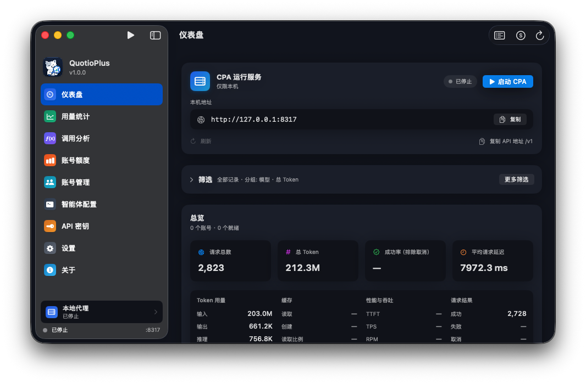
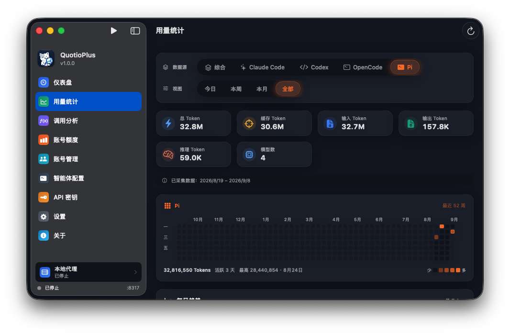
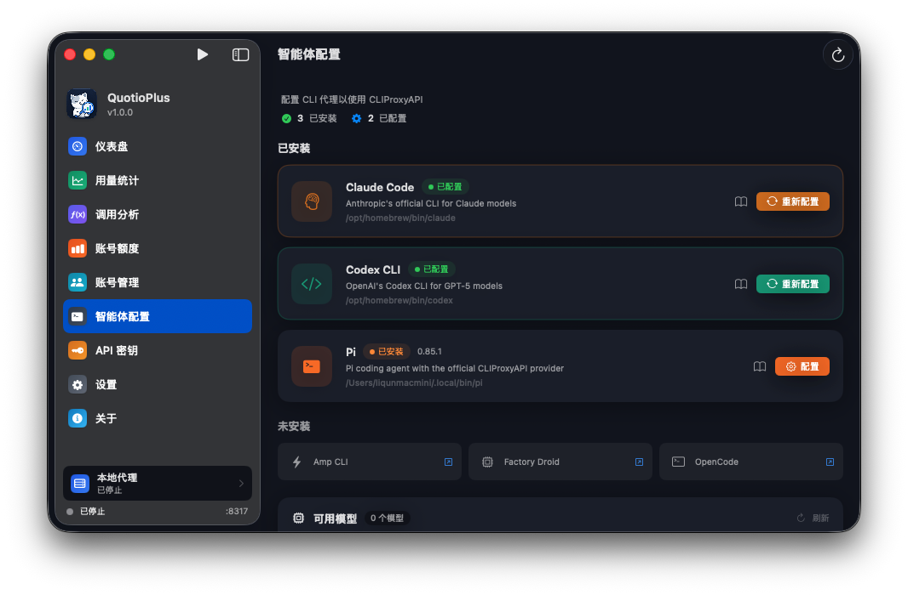

# QuotioPlus


[English](README.md) · **简体中文**

**QuotioPlus 1.0.0** 是基于 [Trong Nguyen（@nguyenphutrong）](https://github.com/nguyenphutrong) 的开源项目 [Quotio](https://github.com/nguyenphutrong/quotio) 进行二次开发的原生 macOS 应用，用于管理 AI 账号、代理服务、客户端配置、配额和使用统计。

> **来源声明与致谢**：本项目是在原作者代码基础上的独立二次开发版本。感谢 Trong Nguyen 和 Quotio 的所有贡献者开放源码、持续维护，为本项目提供了基础。我们保留原项目的版权声明与 MIT 许可证；QuotioPlus 的版本、更新和问题反馈由本仓库独立维护。

[下载 1.0.0](https://github.com/Geoege-xll/quotio/releases/tag/v1.0.0) · [发行说明](docs/releases/1.0.0.md) · [反馈问题](https://github.com/Geoege-xll/quotio/issues) · [原作者项目](https://github.com/nguyenphutrong/quotio)

## 项目截图

以下为 QuotioPlus 1.0.0 的简体中文界面实拍。画面中的数值来自本地已采集历史；未取得的指标继续显示为未知。

**仪表盘：可折叠筛选区、四个主要指标与紧凑的次级统计。**



| 用量统计 | 智能体配置 |
| --- | --- |
| [](screenshots/v1.0.0/client-usage.png) | [](screenshots/v1.0.0/agent-setup.png) |

点击预览图可查看完整截图。

## 1.0.0 的主要功能

- **账号与代理管理**：统一管理多提供商账号、OAuth/API Key、本地代理与配额监控，支持菜单栏快速查看状态。
- **仪表盘**：展示请求量、Token、成功率、缓存、延迟等指标；支持折叠筛选区和完整筛选弹窗。
- **客户端用量统计**：读取 Claude Code、Codex、OpenCode、Pi 的本地记录，按时间、来源和模型展示 Token 使用情况。
- **调用分析**：查看工具、MCP、技能与代理调用分布，支持来源、类型和时间范围筛选。
- **请求明细与价格统计**：查看本地采集的 CPA 请求，配置模型价格并估算费用；缺失的信息明确显示为未知。
- **智能体配置**：支持模型映射、默认模型和提供商配置，兼容 Pi 的 Homebrew、npm 等安装方式。
- **统计性能优化**：统一使用 SQLite，展示读取持久化汇总，扫描按变化内容处理，减少大历史数据的重复加载与内存占用。
- **存储维护**：在「设置 → 诊断与维护 → 维护入口 → 存储与数据」清理缓存、按模块清除统计或回收数据库空闲空间。
- **独立更新与上游维护**：应用更新使用本仓库；原作者项目的更新检查单独放在「诊断与维护」，便于后续同步源码。

客户端 Token、CPA 网关请求和工具调用是不同统计口径，分别展示。清理统计不会删除客户端源日志，现存日志可在后续采集时重新导入。

## 安装

要求 **macOS 14 或更新版本**。从本仓库的 [Releases](https://github.com/Geoege-xll/quotio/releases) 下载 `Quotio-1.0.0.dmg` 或 ZIP，应用显示名称为 **QuotioPlus**，发布构建同时支持 Apple Silicon 和 Intel Mac。

每个发行版会注明是否经过 Developer ID 签名及 Apple 公证。未配置发布证书时，安装包使用临时签名，macOS 可能要求额外确认。自动安装更新仅在本项目的 Sparkle 签名配置完整时启用；其他构建通过本仓库发布页手动更新。

当前没有本二开版的官方 Homebrew 安装入口。原作者的 `nguyenphutrong/tap` 安装的是上游 Quotio。

## 从源码构建

```bash
git clone https://github.com/Geoege-xll/quotio.git
cd quotio
open Quotio.xcodeproj
```

使用 Xcode 26.1 或更新版本，选择 `Quotio` scheme 后构建运行。也可从终端构建：

```bash
xcodebuild -project Quotio.xcodeproj -scheme Quotio \
  -configuration Debug -destination 'platform=macOS' build
```

应用 Bundle ID 为 `com.app.george.quotioplus`。本地签名或开发覆盖配置放在不受版本管理的 `Config/Local.xcconfig`，示例见 [Local.xcconfig.example](Config/Local.xcconfig.example)。发布流程见 [RELEASE.md](RELEASE.md)。

## 开源来源与感谢

| 项目 | 在 QuotioPlus 中的作用 |
| --- | --- |
| [Quotio · Trong Nguyen 与贡献者](https://github.com/nguyenphutrong/quotio) | 二次开发的主要代码基础：原生应用、账号、配额、代理和客户端管理。 |
| [CLIProxyAPI · router-for-me](https://github.com/router-for-me/CLIProxyAPI) | 应用管理的代理服务。 |
| [EasyCLIProxyAPI · router-for-me](https://github.com/router-for-me/EasyCLIProxyAPI) | 仪表盘 usage 统计口径、筛选和展示行为的参考。 |
| [AIUsage · sylearn 与贡献者](https://github.com/sylearn/AIUsage) | 用量统计、调用分析和部分原生界面的移植与参考，详见[来源说明](docs/licenses/AIUsage-attribution.md)。 |
| [cc-switch · farion1231 与贡献者](https://github.com/farion1231/cc-switch) | 客户端配置与模型映射行为的参考。 |
| [Sparkle](https://github.com/sparkle-project/Sparkle) | macOS 应用更新框架。 |

感谢以上作者和社区贡献者。本仓库保留上游提交历史，并将本项目首发前的开发改动整理为一个 `1.0.0` 版本提交，方便阅读、发布和后续维护。

## 许可证与维护

应用主体沿用 [MIT License](LICENSE)，保留原作者 `Copyright (c) 2025 Trong Nguyen`。AIUsage 移植部分保留来源、修改说明及 [Apache License 2.0](docs/licenses/AIUsage-Apache-2.0.txt)。其他依赖分别遵循其许可证。

二开维护和上游同步方式见 [二次开发维护指南](docs/SECONDARY_DEVELOPMENT.md)。本项目的问题请在 [Geoege-xll/quotio Issues](https://github.com/Geoege-xll/quotio/issues) 提交。
